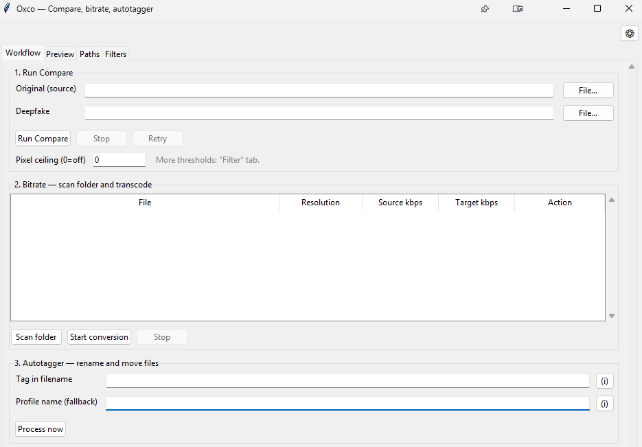

# Oxco

Oxco is a small **desktop app** (Windows-friendly) that bundles a few video helpers in one place:

- **Compare** — pair originals with deepfakes, run exports through DaVinci, and work through many clips in a row.
- **Bitrate** — scan folders and transcode videos using simple height-based rules.
- **Preview** — scrub two clips side by side to tune difference settings before a full compare run.
- **Autotagger** — rename and move files using a pattern you define, with a built-in thumbnail preview so you can see who is in each clip before you tag it.

It is meant for personal workflows (e.g. checking edits, batch housekeeping), not as a forensic guarantee.

## Typical workflow

Oxco’s **Workflow** tab is a three-step pipeline:

1. **Compare** — Point Oxco at your original and deepfake folders, then **Load lists**. You get two sortable lists (by date, size, length, folder, and more). Matching length and resolution are highlighted so similar pairs stand out. Click an original and Oxco jumps to the best matching deepfake. Run one pair or select several deepfakes and **Run batch** to queue them one after another.

2. **Bitrate** — Scan the compare export folder (or any folder), pick target sizes, and convert. You can send finished files straight to the autotagger input folder.

3. **Autotagger** — **Load list** shows every `.mp4` waiting to be tagged. Select a file: a **Preview** panel on the right shows a still from the clip. Use the slider or **Play** to find a clear frame and decide which tag fits. Then run **Process** (or only the rows you selected).

The separate **Preview** tab is still there if you want a larger side-by-side view while tuning compare filters.

## Screenshot

Screenshot of the main Oxco window (`UI.png` in the repository root).

## Requirements

- **Windows** is the primary target (other platforms are untested).
- **Python 3.10+** if you run from source.

### FFmpeg / ffprobe (recommended)

For reliable video analysis (length, resolution, transcoding) and optional exports, **ffmpeg** and **ffprobe** should be available:

- **Option A:** Install them and add both to your system **PATH**, or  
- **Option B:** Place `ffmpeg.exe` and `ffprobe.exe` in the **same folder** as `Oxco.exe` (release build) or next to `compare.py` / the project root when running from source.

Without them, some features may fail or fall back to limited behaviour.

### DaVinci Resolve (optional)

DaVinci-related compare steps only run if you install **DaVinci Resolve Studio**, enable scripting, and fill in the paths in `settings.ini` (see the example file).

## Quick start (source)

1. Clone the repository.
2. Double-click **`install.bat`** (or run `pip install -r requirements.txt` in the project folder).
3. Copy **`settings.example.ini`** to **`settings.ini`** in the same folder (Oxco creates this copy on first launch if it is missing).
4. Run **`python oxco_gui.py`**.

Your window layout and paths are stored in **`oxco_config.json`** in the app folder. The repository ships a **neutral template**; replace values with your own.

## Windows one-folder executable

Use **`build_onedir.bat`**. It installs PyInstaller if needed and writes `dist/Oxco/`. No extra build steps are needed after code changes — just run the script again.

- **`compare.py`** and **`settings.example.ini`** are placed next to **`Oxco.exe`** automatically by the build script.
- On first launch, Oxco copies `settings.example.ini` → `settings.ini` if it is missing.
- You still need **ffmpeg/ffprobe** on PATH or beside the executable for full support.

### What works in the `.exe`?

It is the **same application** as when you run `python oxco_gui.py`: all tabs (workflow, preview, filters, paths, log), the preview player, dual compare lists, batch compare, bitrate tools, and the autotagger with clip preview are packaged into the bundle (`Oxco.exe` plus the `_internal` folder).

**Compare** does not use a separate Python install: Oxco starts a second copy of **`Oxco.exe`** with the hidden flag **`--oxco-compare`**, which runs `compare.py` from the folder next to the executable — so behaviour stays aligned with the source tree.

## License

This project is released under the **MIT License** — see [`LICENSE`](LICENSE).
